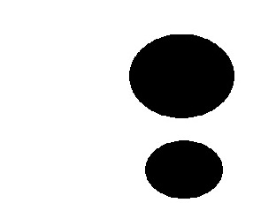

# Arithmetic Operations on Images
We can carry out arithmetic operations like adding and subtracting images using OpenCV Python.

### Requirement
_pip install opencv-python_

## Addition of Images 
We can add two images using the function **cv2.addWeighted()**.  
It takes 5 arguments image1, image2, weight of image1, weight of image2 and light value of final image. 

            

The final output image after addition is:  

 

## Subtraction of Images
To subtract two images, use the function **cv2.subtract(image1,image2)**.  

                

The final Output image obtained after subtracting is:  

 

