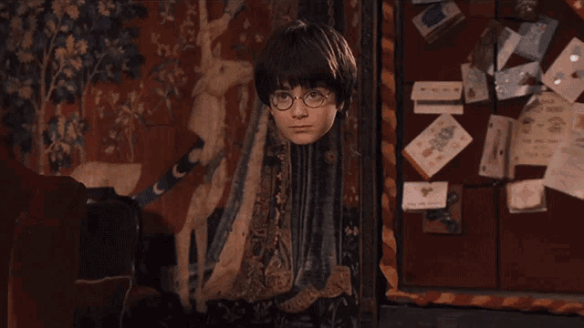

# How does this algorithm work ?

<h3>
The algorithm is very similar in principle to green screening. But unlike green screening where we remove the background, in this application, we remove the foreground! As everyone is a fan of <i>Harry Potter World and Hogwartz</i>. So today, I am going to show you the magic of <u>Invisibility Cloak</u> of Harry with Computer Vision.
</h3>

 

<i>The project comprises of 5 simple steps:</i>

<ol>
    <li>Importing the required libraries.</li>
    <li>Capture and store the background frame [This will be done for some seconds]</li>
    <li>Detect the red colored cloth using color detection and segmentation algorithm.</li>
    <li>Segment out the red colored cloth by generating a mask. [used in code]</li>
    <li>Generate the final augmented output to create a magical effect. [output.avi]</li>
</ol>

<h4>Step 1: Importing the required libraries.</h4>
We have to import all the necessary libraries into the code. “cv2” is for OpenCV, “time” is for time-related operations, and “numpy” is for numerical purposes. We are writing the video in fourcc and saving the video output as <i>output.avi.</i>

 

<h4>Step 2: Capture and store the background frame.</h4>
In order to create an invisible effect, we have to remove the red-colored pixels from the background and store the background image of each frame. For capturing the frame we have used cap.read(). The variable ‘ret’ is used to return the boolean value.

 

<h4>Step 3: Detect the red colored cloth using color detection and segmentation algorithm.</h4>
Here we will convert the RGB (Red-Blue-Green) to HSV (Hue-Saturation-Value) because RGB value is too sensitive.

 

<h4>Step 4: Segment out the red colored cloth by generating a mask.</h4>

 

<h4>Step 5: Generate the final augmented output to create a magical effect.</h4>
The final step, in which red-colored pixel is removed, and we obtain the desired output.