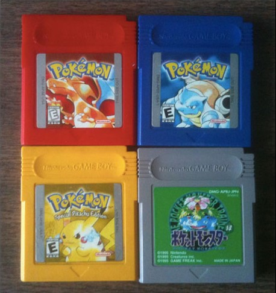
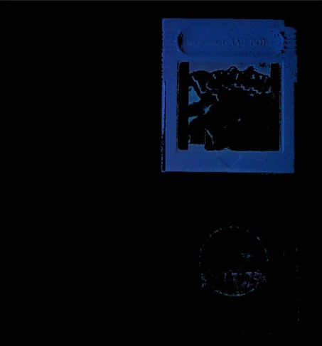

## **Color detection using Image Masking**

As the name suggests " _Color Detection_ " is method of identifying and segregating colors of different shades from a particular image. Here, we are doing this color detection with the help of Image Masking technique. 

Image Masking is a powerful technique in OpenCV and Image Processing. It is the process of separating an image from its background, either to cause the image to stand out on its own or to place the image over another background.

It sets up certain pixels of an image to some null value such as zero. The reason this is done because for some reason parts of an image are not to be examined.Mask allows us to focus on the portions of the image that interest us.

We can eliminate, extract or detach an object from the rest of the picture using the image masking technique.

Masking can be done in one of two ways:

* Using an image as a mask. A mask image is simply an image where some of the pixel intensity values are zero, and others are non-zero. Wherever the pixel intensity value is zero in the mask image, then the pixel intensity of the resulting masked image will be set to the background value (normally zero).

* Using a set of ROIs as the mask. The ROIs for each slice are used to define the mask.

## Whats & Whys of the Code

> Libraries used : numpy , openCV

 Firstly we read the image into which we want to detect the particular shade or color.

 We then convert the image into HSV format which is a device independent color representation format. The HSV color representation is useful to detect specific color types.

 We then create a mask for a particular color which needs to be detected. For this we create a numpy array and choose a hue range between which if the pixel lies it would detect that. 
 
 Where the range's lower limit is defined by _lower_hsv = ( ( x/2 ) -5 ,100,100 )_ and range's upper limit is defined by _upper_hsv = ( ( x/2 ) + 5 ,255,255 )_ .

 After crating the mask we apply is on the image with the help of _cv2.bitwise_and()_ which performs bitwise operations on the image.

 
 

 _Note : The best part behind the use of " __Image Masking__ " for " __Color Detection__ " is that it doesn't impacts the pixels of the background nor the hue regions which falls outside the tracked range._

## **Sample Input**

 

 
 

## **Sample Output**

 

 
 

_Here the selected hue range was blue._

