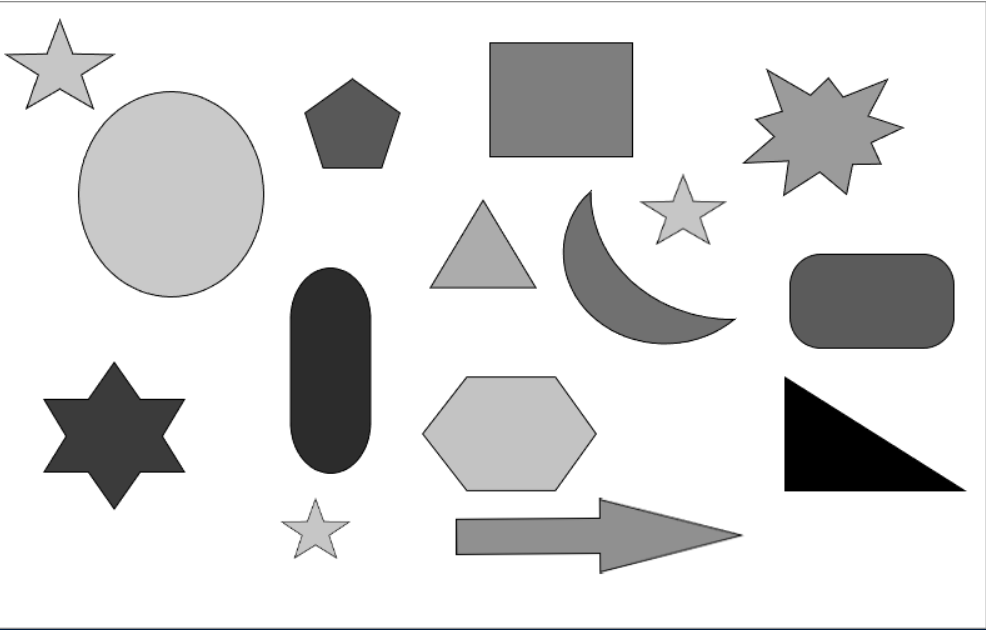
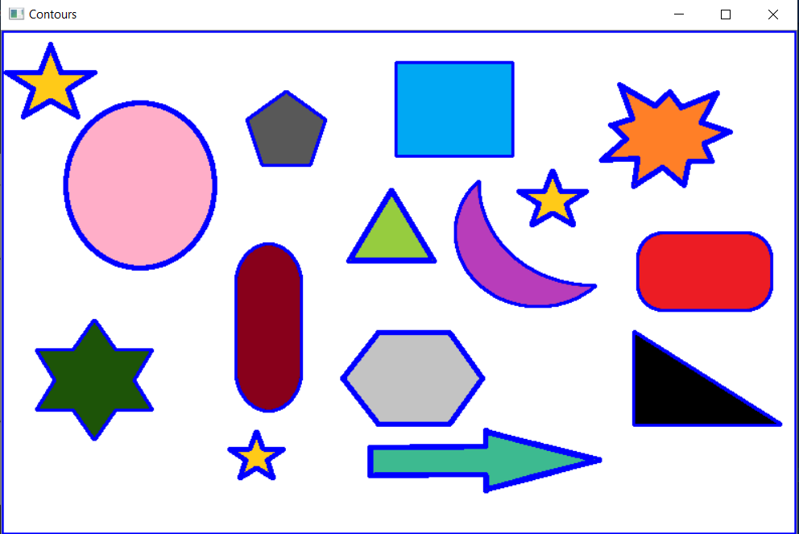

# Contour Detection
A contour is a curve joining (continuous) points along a boundary. In simple terms, a contour is an outline of an object, shape, irregular figure, curved areas etc. Contour Detection is useful in areas like Object Detection and Recognition, and Shape Analysis. 

## Syntax
To find contours in an image we use the following syntax :-
```
cv2.findContours(image, mode, method, contours=None, hierarchy=None, offset=None)
```
The method, _findContours()_ requires three parameters.

* **_image_** specifies the image we want to find the contours in. Using binary images gives us a more accurate output, and hence thesholding is applied to the original image.
* **_mode_** specifies the hierarchy that the contours are returned in (relationship between the contours).
    > RETR_EXTERNAL gives the _outer_ contours. If contours are enclosed in others, the outermost one is given.

    > RETR_LIST gives all contours and doesn't consider any hierarchy between the contours.

    > RETR_TREE gives the complete hierarchy of the contours. 

    > RETR_CCOMP extracts the contours and organizes them into a 2-level hierarchy(outer and inner contours).
* **_method_** specifies how to save the points representing the boundary of a contour. 
    > cv2.CHAIN_APPROX_NONE saves all the points on the boundary of the contour.

    > cv2.CHAIN_APPROX_SIMPLE removes redundant points and compresses the contour. 

    It's preferred to use CHAIN_APPROX_SIMPLE to save memory. Instead of considering all points of a line, the two extreme points are enough to draw it. Or in the case of a square, the four courners are enough to draw the square. This is how CHAIN_APPROX_SIMPLE works.

<br/>

The function returns two values, contours and hierarchy. Hierarchy gives us information about the image topology. 

**Contours** is a python list of all the contours in the image. Each contour is a numpy array of (x,y) coordinates of the boundary points of the detected contour.

<br/>

To view the contours detected, we use the following syntax :-
```
cv2.drawContours(image, contours, contourIndex, color, thickness=None,)
```
The method, _drawContours()_ requires the following parameters

* **_image_** specifies the source image we want to draw the contours on.
* **_contours_** specifies the contours detected on the image.
* **_contourIndex_** specifies the index till/the number of contours that are desired to be drawn. 
    * -1 can be given to draw all contours.
* **_color_** specifies the color of the contour.
* **_thickness_** specifies the thickness of the contour

<br/>

## Working and Implementation
**Step 1.** The image is first converted to grayscale in order to apply thresholding to it. The image after grayscaling would look like this;
<p align="center">
          
</p>
<br/>

**Step 2.** Simple Thresholding is applied to the image. Applying Thresholding methods would give us a binary image, using which we could expect a better accuracy in detecting contours. The image after applying simple thresholding would look like this;
<p align="center">
          
</p>
<br/>

**Step 3.** Contours are detecting with the help of cv2.findContours() method.
<br/>

**Step 4.** The detected contours can be viewed with the help of cv2.drawContours().
<p align="center">
          
</p>

<br/><br/>


>Written by [Soumya Vemuri](https://github.com/soumyavemuri)
