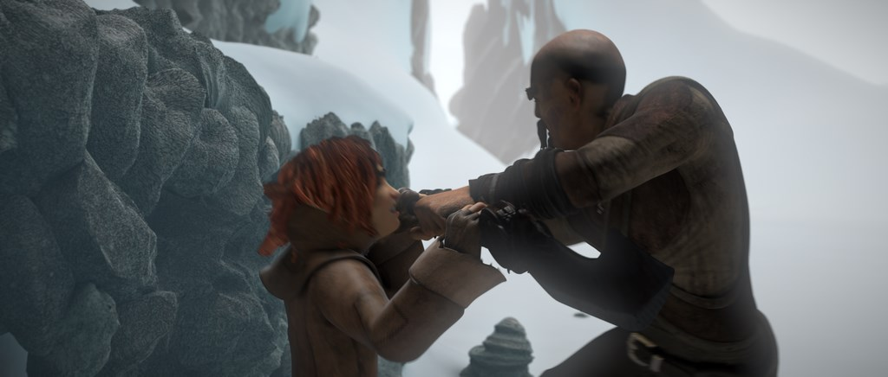
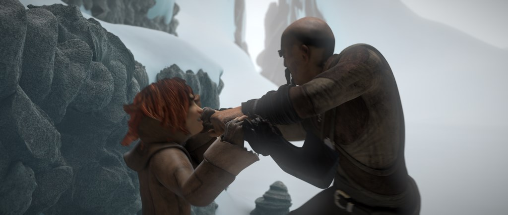
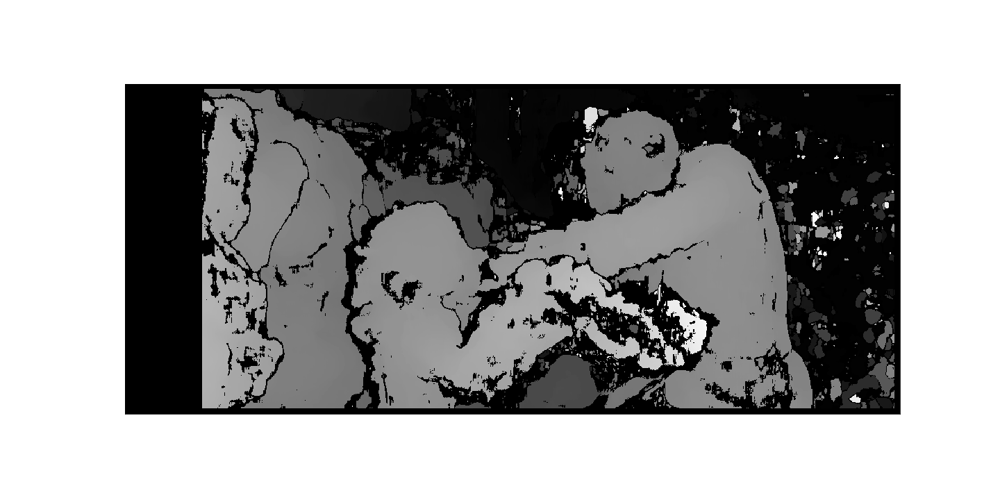

# Depth Map

A depth map is a picture where every pixel has depth information and it normally represented as a greyscale picture. In this stereo images are used. Stereo images are  images with slight offset. In this disparity is calculated using 'stereo.compute'.

---

### stereo images

Left and Right images.

   

 
   
---
### Output image

