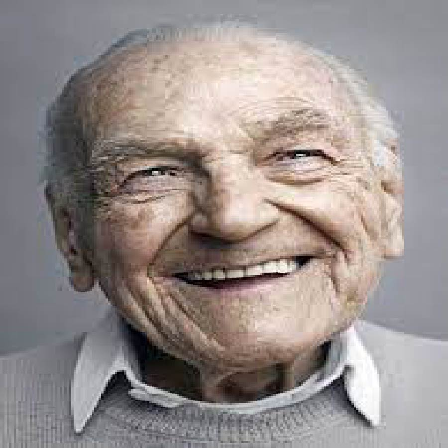

# Converting an image into ghost image.

Used OpenCv and Numpy to convert an image into ghost image.

## Steps:
* Imported the required libraries ( Numpy, Matplotlib, Cv2)
* Read the input image using cv2

### Methods applied Using Cv2
* Used Bilateral Filter
* Used Median Blur
* Used Adaptive Threshold
* Used Bitwise Xor
* Finally converted the image into ghost image

## Original Image

## Ghostified Image

