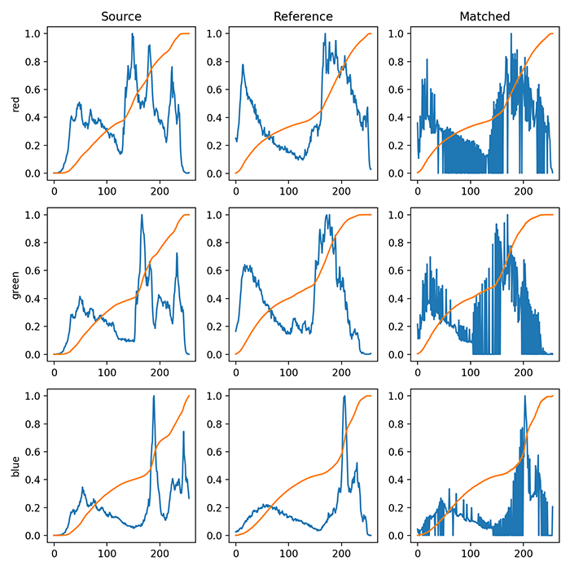

# Histogram matching using open CV

Histogram matching is beneficial when applying image processing pipelines to images captured in different lighting conditions, thereby creating a “normalized” representation of images, regardless of the lighting conditions they were captured in (with reasonable expectations set on how much the lighting conditions change, of course).

## Histogram matching with OpenCV, scikit-image, and Python

### What is histogram matching?


Histogram matching can best be thought of as a “transformation.” Our goal is to take an input image (the “source”) and update its pixel intensities such that the distribution of the input image histogram matches the distribution of a reference image.

While the input image’s actual contents do not change, the pixel distribution does, thereby adjusting the illumination and contrast of the input image based on the distribution of the reference image.

Applying histogram matching allows us to obtain interesting aesthetic results (as we’ll see later in this tutorial).

Additionally, we can use histogram matching as a form of basic color correction/color constancy, allowing us to build better, more reliable image processing pipelines without leveraging complex, computationally expensive machine learning and deep learning algorithms.

### How can OpenCV and scikit-image be used for histogram matching?

Histogram matching can be a real pain to implement by hand, but luckily for us, the scikit-image library already has a match_histograms function (the documentation you can find <a href="https://scikit-image.org/docs/dev/api/skimage.exposure.html#skimage.exposure.match_histograms">here</a>).

Applying histogram matching is therefore as simple as loading two images with OpenCV’s cv2.imread and then calling scikit-image’s match_histograms function:

```
src = cv2.imread(args["source"])
ref = cv2.imread(args["reference"])
multi = True if src.shape[-1] > 1 else False
matched = exposure.match_histograms(src, ref, multichannel=multi)
```

### Configuring your development environment

To learn how to perform histogram matching, you need to have both OpenCV and scikit-image installed:
Both are pip-installable:

```
$ pip install opencv-contrib-python
$ pip install scikit-image
```

### Project structure

Before we can implement histogram matching with OpenCV and scikit-image, let’s first use our project directory structure.
Take a look at our project directory structure:

```
$ tree . --dirsfirst
.
├── empire_state_cloudy.png
├── empire_state_sunset.png
└── match_histograms.py

0 directories, 3 files
```

We have only one Python script to review, match_histograms.py, which will load empire_state_cloud.png (the source image) along with empire_state_sunset.png (the reference image).

Our script will then apply histogram matching to transfer the color distribution from the reference image onto the source image.

In this case, we’ll be able to convert a photo taken on a cloudy day to a beautiful sunset!

### Histogram matching results

We are now ready to apply histogram matching with OpenCV!

From there, we open a shell and execute the following command:

```
$ python match_histograms.py --source empire_state_cloudy.png \
	--reference empire_state_sunset.png
[INFO] loading source and reference images...
[INFO] performing histogram matching...
```

This displays the histograms of the source, reference, and matched image for each of the Red, Green, and Blue channels of the images, respectively:



The “Source” column shows the distribution of pixel intensities in our input source image. The “Reference” column displays the distribution for the reference image we loaded from disk. And finally, the “Matched” column displays the output of applying histogram matching.
Notice how the source pixel intensities are adjusted to match the distribution of the reference image! That operation, in essence, is histogram matching.
