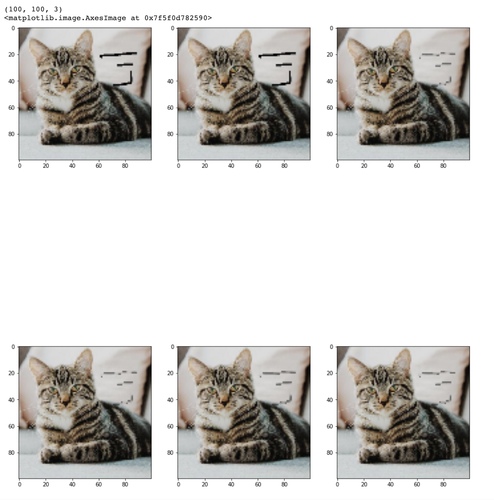

# Image Inpainting

Restore images using image inpainting with OpenCV in Python using four different techniques with a single line of code.

## Requirements
OpenCV Contrib is required for two of those methods so that can be installed using pip:

```
pip install opencv-contrib-python==4.3.0.36
```

# Input Image 

| Input     | Input      |
|------------|-------------|
|  |  |

# Output Image

| Output     |
|------------|
|  |

