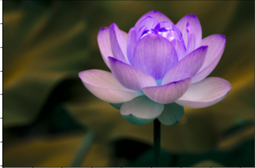
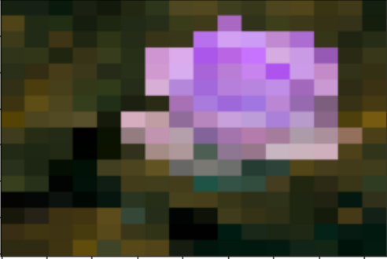

<h1>Image Pixelation</h1>

<h2>What are Image Pixels</h2>
  

    A pixel(or picture element) is the smallest item of information in an image. Pixels are basically arranged in a 2-dimensional grid that represents using squares. Each pixel is a sample of an original image, where more samples typically provide more-accurate representations of the original. The intensity of each pixel is variable; in color systems, each pixel has typically three or four components such as red, green, and blue, or cyan, magenta, yellow, and black.
  

  

  
  

  <h2>What is Image Pixelation</h2>
  
Pixelation is the term used in computer graphics to describe blurry sections or fuzziness in an image due to visibility of single-colored square display elements or individual pixels. It mostly occurs with non-vector or raster-based images or with images which are resolution dependent due to the number of pixels per inch of the image being low. For a good quality image, pixelation must be avoided or minimized.

  

  
  

  <h3>Original Image</h3>
  
  

  
  

  <h3>Pixelated Image</h3>
  
  

