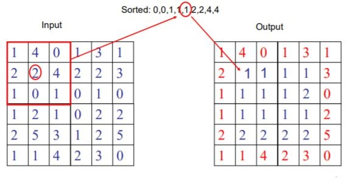
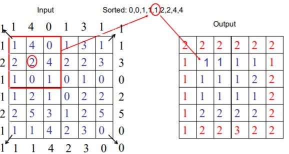
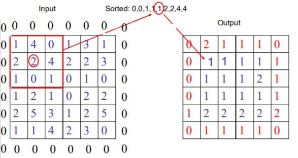

# Median Filtering

__Median filtering__ is a common nonlinear method for noise suppression that has unique characteristics. It does not use convolution to process the image with a kernel of coefficients. Rather, in each position of the kernel frame, a pixel of the input image contained in the frame is selected to become the output pixel located at the coordinates of the kernel center. The kernel frame is centered on each pixel _(m, n)_ of the original image, and the median value of pixels within the kernel frame is computed. The pixel at the coordinates _(m, n)_ of the output image is set to this median value.

It is widely used as it is very useful in removing noises while preserving the edges. It is particularly effective in removing _salt and pepper_ type of noises.

Let's explain this with the use of an example.

Take a 3X3 matrix of pixel values:

> [ 22, 24, 27]

>[ 31, 98, 29]

>[ 27, 22, 23]

 

Notice the center pixel: the clear outlier in this matrix. Outliers like this can produce what is called salt-and-pepper noise, which produces an image that looks some what like this
 
 

 

The filtering algorithm will scan the entire image, using a small matrix (like the 3x3 depicted above), and recalculate the value of the center pixel by simply taking the median of all of the values inside the matrix. With the example above, the sorted values are [22, 22, 23, 24, 27, 27, 29, 31, 98], and median of this set is 27.

 

### Difference between Median & Gaussian Filtering

 

> Left: Median Filtering, Right: Gaussian Filtering

 
 

## Different  forms of Median Filtering (using 3X3 sample window)

 

### Keeping border values unchanged 
 
 

 
 

### Extending border values at outside with values at boundary
 
 

 
 

### Extending border values at outside with 0's
 
 

