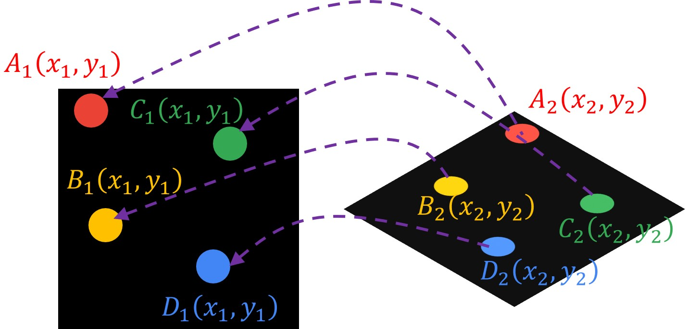
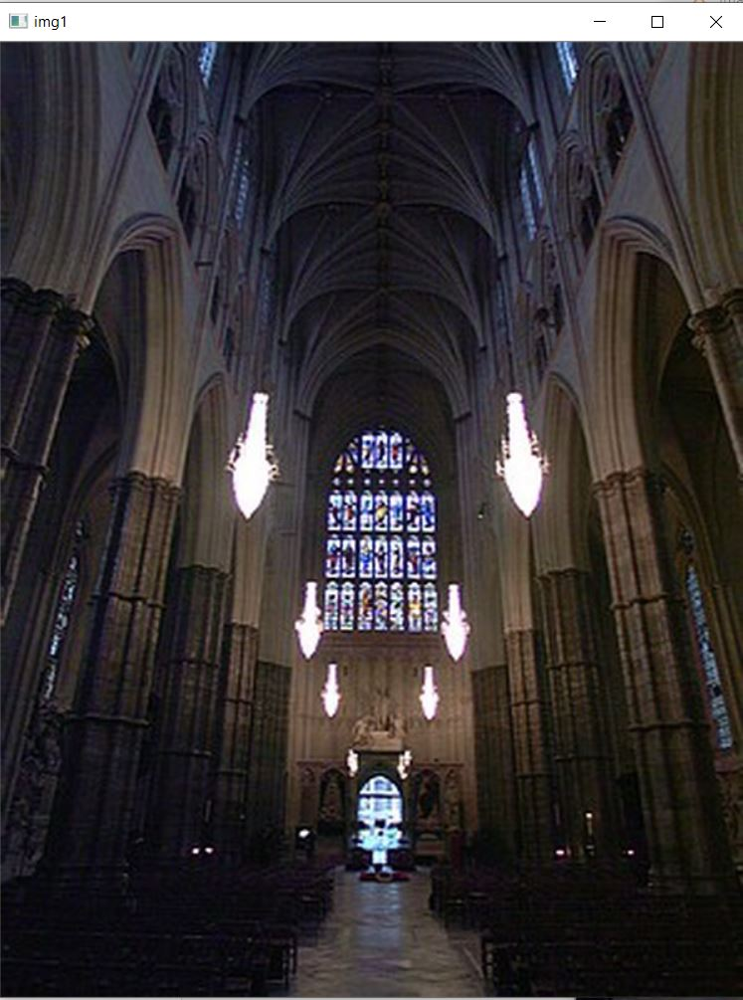
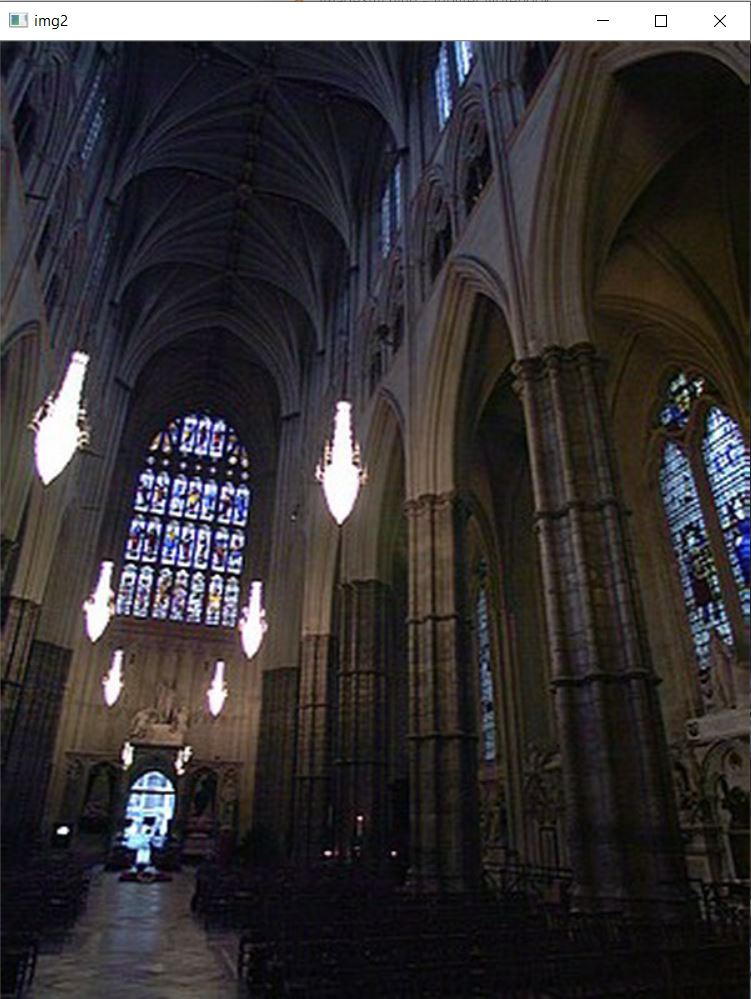
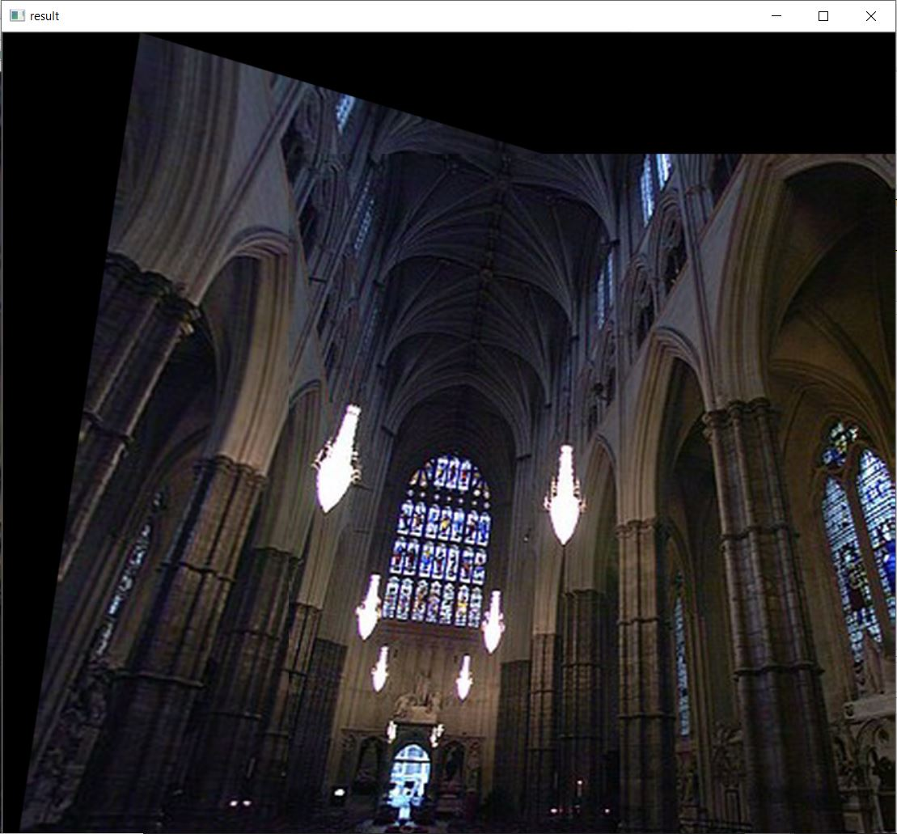

# Image Stitching (of two Images)

__Image stitching__ is the process of combining multiple photographic images with overlapping fields of view to produce a segmented panorama or high-resolution image. Commonly performed through the use of computer software, most approaches to image stitching require nearly exact overlaps between images and identical exposures to produce seamless results, although some stitching algorithms actually benefit from differently exposed images by doing high-dynamic-range imaging in regions of overlap. Some digital cameras can stitch their photos internally.

## __Process__

The image stitching process can be divided into below mentioned components:

* __Loading the Images__
* __Keypoint detection__

    Keypoint detection involves simultaneously detecting people and localizing their keypoints. Keypoints are the same thing as interest points. They are spatial locations, or points in the image that define what is interesting or what stand out in the image. They are invariant to image rotation, shrinkage, translation, distortion, and so on.

    Feature detection is the process of computing the
    abstraction of the image information(using _keypoints_ and _descriptors_ ) and making a local
    decision at every image point to see if there is an image feature of the given type existing in that point. For feature detection there are three different algorithms which could be used __SIFT__, __SURF__ and __ORB__.

    SIFT and SURF are recent key-point or interest point detector algorithms but a point to note is that these are patented and their commercial usage restricted. ORB doesn't have such limitations. 

* __Registration__

    _Image registration_ involves matching features in a set of images or using direct alignment methods to search for image alignments that minimize the sum of absolute differences between overlapping pixels. When using direct alignment methods one might first calibrate one's images to get better results. Additionally, users may input a rough model of the panorama to help the feature matching stage, so that only neighboring images are searched for matching features. Since there are smaller group of features for matching, the result of the search is more accurate and execution of the comparison is faster.

    To estimate a robust model from the data, a common method used is known as RANSAC. The name RANSAC is an abbreviation for "RANdom SAmple Consensus". It is an iterative method for robust parameter estimation to fit mathematical models from sets of observed data points which may contain outliers. The algorithm is non-deterministic in the sense that it produces a reasonable result only with a certain probability, with this probability increasing as more iterations are performed. It being a probabilistic method means that different results will be obtained for every time the algorithm is run.

  The RANSAC algorithm has found many applications in computer vision, including the simultaneous solving of the correspondence problem and the estimation of the fundamental matrix related to a pair of stereo cameras. The basic assumption of the method is that the data consists of "inliers", i.e., data whose distribution can be explained by some mathematical model, and "outliers" which are data that do not fit the model. Outliers are considered points which come from noise, erroneous measurements, or simply incorrect data.

    For the problem of homography estimation, RANSAC works by trying to fit several models using some of the point pairs and then checking if the models were able to relate most of the points. The best model – the homography, which produces the highest number of correct matches – is then chosen as the answer for the problem; thus, if the ratio of number of outliers to data points is very low, the RANSAC outputs a decent model fitting the data.

* __Calibration__

    Image calibration aims to minimize differences between an ideal lens models and the camera-lens combination that was used, optical defects such as distortions, exposure differences between images, vignetting,[9] camera response and chromatic aberrations. If feature detection methods were used to register images and absolute positions of the features were recorded and saved, stitching software may use the data for geometric optimization of the images in addition to placing the images on the panosphere.

* __Alignment__

    Alignment may be necessary to transform an image to match the view point of the image it is being composited with. Alignment, in simple terms, is a change in the coordinates system so that it adopts a new coordinate system which outputs image matching the required viewpoint. The types of transformations an image may go through are pure translation, pure rotation, a similarity transform which includes translation, rotation and scaling of the image which needs to be transformed.

* __Compositing__

    Compositing is the process where the rectified images are aligned in such a way that they appear as a single shot of a scene. Compositing can be automatically done since the algorithm now knows which correspondences overlap.

* __Blending__

    Image blending involves executing the adjustments figured out in the calibration stage, combined with remapping of the images to an output projection. Colors are adjusted between images to compensate for exposure differences. If applicable, high dynamic range merging is done along with motion compensation and deghosting. Images are blended together and seam line adjustment is done to minimize the visibility of seams between images.

## __Whats & Whys of Code__

>Libraraies required: numpy , OpenCV

1. Loading the two images and converting them into _grayscale_. To achieve more accurate results we convert the images as a grayscale.

2. Now, we will use the _ORB_ detector to extract the keypoints. First, we will create an ORB detector with the function _cv2.ORB_create()_. This function consists of a number of optional parameters. The most useful one is _nfeatures_ which denotes the maximum number of features to be detected. By default, this number is set to 500 but we can change it if we want to detect more features. 

    Next, after we specify the number of keypoints that we want to detect we will detect keypoints and descriptors in both images using the function _orb.detectAndCompute()_.

    Using the function _cv2.drawKeypoints_ we can draw key points in our image. This function consists of the following parameters: input image, detected keypoints, output image (its content depends on the value of the flag defining what is drawn in the output image and the color of keypoints).

3. Once we have extracted the features, the next step is to match these features between our two images.

    We learned that for each detected keypoint we have one descriptor. These descriptors are arrays of numbers that define the keypoints. So, in order to match features, we are going to compare descriptors from the first image with descriptors from the second image. We will also sort matching points by their distance in order to find the closest ones. In our code, we will use the Brute Force matcher to match the descriptors.

    First, we have to create the _BFMatcher_ object using the function _cv2.BFMatcher_create()_. This function consists of an optional parameter normType that specifies the distance as a measurement of similarity between two descriptors. For binary string based descriptors like ORB, we usually use _cv.NORM_HAMMING_.

    The second parameter is _crossCheck_. By default, it is set to _False_. In that case, BFMatcher will find the _k nearest neighbors_ for each query descriptor. On the other hand if _crossCheck==True_, then the _knnMatch()_ method will return only those matches with value (i,j) such that i-th descriptor in set A has j-th descriptor in set B as the best match and vice-versa. In that way, the two features in both sets should match each other. Such a technique usually produces the best results with a minimal number of outliers when there are enough matches. However, in our code, this parameter is switched of because to find the best matches we will use another method.

4. The next step is to define function draw_matches() that will be used to match overlapping keypoints. 

    This function consists of the following parameters:

    * img1, img2 – the input images
    * key1 – keypoints detected in the first image
    * key2 – keypoins detected in the second image
    * matches – overlapping keypoins

    In the second line of this function, we are defining the row and the column of the first and the second image. Then, we create a black image using the function _np.zeros()_. This image will have the same dimensions as the output image where two input images are stitched together. That is why we will set the number of rows to the larger of the two values, and the number of columns will be the sum of both values. For a color image, we also need to create three channels and stack them together. We can do that with the function _np.dstack()_. This function stacks 2D arrays in a sequence along the third axis that is perpendicular to the first two axes. For instance, the height of an image is the first axis (indexed as 0), width is the second axis (indexed as 1), and RGB channels are the third axis (indexed as 2).

    The next step is to create for loop which will iterate through all matches. Attribute _match.queryIdx_ gives us the index of the descriptor in the list of train descriptors in the first image ( the index of the point in the first image we want to find a match for ). Argument _match.trainIdx_ gives us the index of the descriptor in the list of query descriptors in the second image (the index of the matching result of that point in the second image). Then, for each item in detected matches, we extract the locations of the matching keypoints.

    Next, we will draw the circles around keypoints with the function _cv2.circle()_ and we draw the line to connect them with the function _cv2.line()_.

5. Now, using the function _draw_matches()_ we can draw matching points in the image. For better visualization, we will draw only the first 30 matches.

6. To keep only the strong matches we will use David Lowe’s ratio test. Our goal is to get rid of the points that are not distinct enough. Basically, we are discarding these matches where the ratio of the distances to the nearest and the second nearest neighbor is greater than a certain threshold. In this way, we will preserve only good matches.

7. To stitch two images together we need to apply a technique called feature-based image alignment. It is the computation of 2D and 3D transformations that map features in one image to another. This technique consists of two steps. The first step is to apply RANSAC algorithm to evaluate a homography matrix. Then, we will use this matrix to calculate the warping transformation based on matched features.

    Using the _Homograhy_ technique we can easily stitch our images together.

    It is important to note that when we match feature points between two images, we only accept those matches that fall on the corresponding epipolar lines. We need these good matches to estimate the homography matrix. We detected a large number of keypoints and we need to reject some of them to retain the best ones.

    Now, we need to calculate the homography. We are applying the function cv2.warpImages()which consist of parameters img1, img2, and H. The first and the second parameter are our two images and H is the homography matrix.

    A 3×3 matrix will be used to transform the second image to have the same perspective as the first one which will be kept as the reference frame. Then, we will extract information about the transformation of the second image and use that information to align the second image with the first one.

    To find this transformation matrix, we need to extract coordinates of a minimum of 4 points in the first image and corresponding 4 points in the second image. These points are related by homography so we can apply a transformation to change the perspective of the second image using the first image as a reference frame.

    In the following image, you can see an example of this transformation:

    

     

    We will create two lists with these points. The first list called _list_of_points_1_ represents coordinates of a reference image, and the second list called _temp_points_ represents coordinates of a second image that we want to transform. Then, we will apply the function _cv2.perspectiveTransform()_ which we use to calculate the transformation matrix (homography). This function requires two arguments: a list of points in the second image and a matrix _H_. Finally, we can warp the second image using the function _cv2.warpPerspective()_. As the parameters of this function, we need to pass our second image, a transformation matrix, and the width and height of our output image.

    Once we have applied the function _cv2.warpImages()_ we are ready to stitch the images. First, we are setting the condition of the minimum number of matches. In our code, that number is set to 10. That means that we need at least 10 matches to find the object. If enough matches are found, we extract the locations of matched keypoints in both the images. Then, we convert keypoints to type _np.float32_ because we will use them as a parameter of a function _cv2.findHomography()_. Now, when we have calculated our homography matrix we can finally stitch images together using the function _cv2.warpImages()_. It is good to remember that feature matching does not always produce 100% accurate matches. That is why cv2.findHomography() method as a parameter, uses the __Random Sample Consensus__ (RANSAC) procedure which makes the function resistant to outliers. Using this method we can obtain accurate results even if we have a high percentage of bad matches.

__Image stitching is widely used in modern applications, such as the following:__

* Document mosaicing
* Image stabilization feature in camcorders that use frame-rate image alignment
* High-resolution photomosaics in digital maps and satellite imagery
* Medical imaging
* Multiple-image super-resolution imaging
* Video stitching
* Object insertion

_Note: This code uses only two images for stitching and uses ORB for feature detection rather than SIFT & SURF (the later ones are not into commercial use because of their patent issues and also they are not available now in the OpenCV versions )_

## Inputs

>Input 1

 
 

>Input 2

 
 

## Stitched Output

